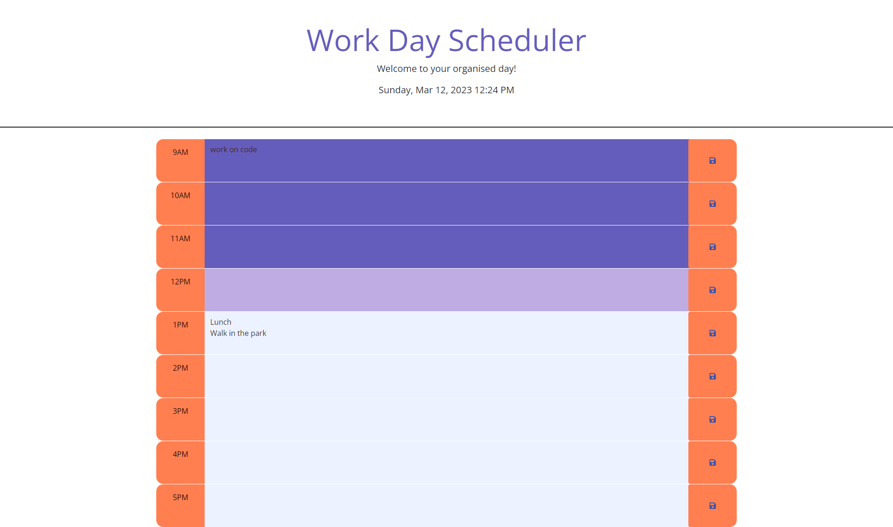

# Work-Day-Schedule

## Description

Creation of a simple calender application that alows a user to see their daily schedule at a glance. This app runs on the browser, using local storage to save events for each day and features dynamically updated HTML and CSS powered by JQuery. Design elements are supported by Bootstrap, and showcase modern colours that change according to the hour passed.

## Usage

https://user-images.githubusercontent.com/122151785/224519281-521e1413-2879-491b-88e7-b997d63dd01c.mp4

https://helmoar.github.io/Work-Day-Scheduler/

## Credits

Caroline Helmore 
chelmore1@bigpond.com

## License

N/A

## Badges

